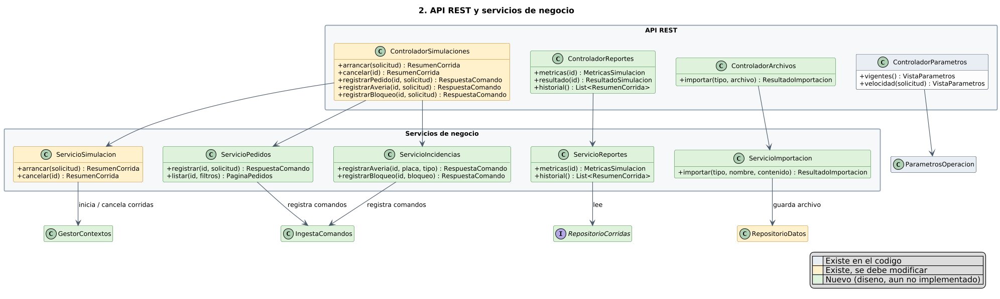
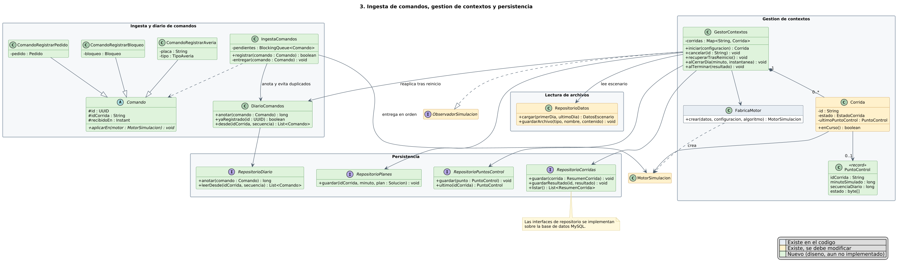
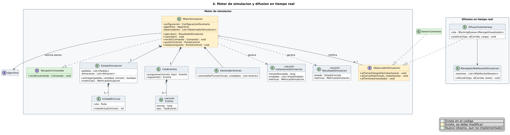
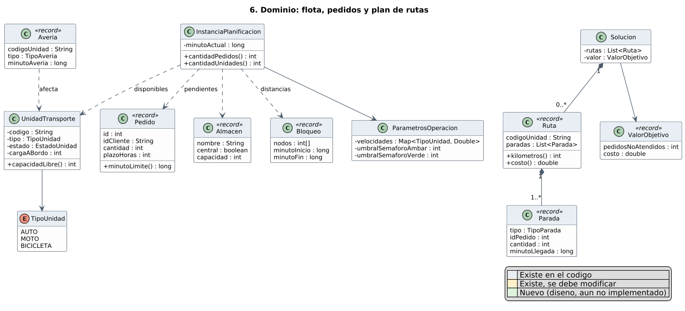

# Diagrama de clases de diseno del backend de KindBox

Diagrama de clases de diseno del backend, organizado segun el diagrama de componentes del
sistema (API REST, servicios de negocio, ingesta y diario de comandos, gestion de contextos,
motor de simulacion, difusion en tiempo real, planificador y persistencia).

Es una vista de diseno: incluye clases que ya existen en el codigo y clases planificadas que
aun no estan implementadas (por ejemplo, la persistencia en MySQL y el diario de comandos).
El color de cada clase indica su estado:

| Color | Significado |
|---|---|
| Celeste | Existe en el codigo y no cambia |
| Amarillo | Existe en el codigo y se debe modificar |
| Verde | Nueva: forma parte del diseno pero aun no esta implementada |

De cada clase se muestran solo los atributos y operaciones que definen su responsabilidad.

## 1. Vista general


Cada recuadro corresponde a un componente del diagrama de componentes y muestra sus clases
principales. El recorrido es: la **API REST** recibe la peticion; los **servicios de negocio**
la atienden. Las acciones sobre una simulacion en curso (registrar un pedido, una averia o un
bloqueo) se convierten en **comandos**, que se anotan en el diario y se entregan en orden al
**motor de simulacion**. La **gestion de contextos** crea el motor de cada corrida, guarda
puntos de control al cierre de cada dia y permite recuperar las corridas tras un reinicio.
El motor pide planes al **planificador** y publica instantaneas por la **difusion en tiempo
real**.

## 2. API REST y servicios de negocio



| Clase | Responsabilidad |
|---|---|
| `ControladorSimulaciones` | Endpoints para arrancar y cancelar corridas y registrar pedidos, averias y bloqueos. **Modificar:** se agregan pedidos y bloqueos |
| `ControladorReportes` | Endpoints de metricas, resultados e historial de corridas |
| `ControladorArchivos` | Endpoint para importar archivos de entrada (ventas, bloqueos, averias, flota) |
| `ControladorParametros` | Endpoints para consultar y ajustar velocidades y umbrales |
| `ServicioSimulacion` | Arranca y cancela corridas. **Modificar:** delega en `GestorContextos` la creacion de corridas y motores, y la consulta de pedidos y el registro de averias pasan a `ServicioPedidos` y `ServicioIncidencias` |
| `ServicioPedidos` | Registra pedidos nuevos como comandos y lista los pedidos de una corrida |
| `ServicioIncidencias` | Registra averias y bloqueos como comandos |
| `ServicioReportes` | Consulta metricas e historial en la persistencia |
| `ServicioImportacion` | Valida un archivo subido y lo guarda en el directorio de archivos de entrada |

## 3. Ingesta de comandos, gestion de contextos y persistencia



| Clase | Responsabilidad |
|---|---|
| `Comando` y subclases | Accion sobre una corrida en curso (registrar pedido, averia o bloqueo). Tiene un `id` unico para detectar duplicados y sabe aplicarse sobre el motor |
| `IngestaComandos` | Recibe los comandos, los anota en el diario, descarta duplicados y los entrega en orden al motor |
| `DiarioComandos` | Registro ordenado de todos los comandos; permite reaplicarlos desde un punto de control |
| `GestorContextos` | Ciclo de vida de las corridas: las crea (con `FabricaMotor` y los datos de `RepositorioDatos`), guarda planes y puntos de control al cierre de cada dia y las recupera tras un reinicio |
| `Corrida` | Una simulacion y su estado. **Modificar:** se agrega su ultimo punto de control |
| `PuntoControl` | Estado del motor en un minuto dado, junto con la posicion del diario hasta la que ya se aplicaron comandos |
| `FabricaMotor` | Crea el `MotorSimulacion` de una corrida |
| `RepositorioCorridas`, `RepositorioPlanes`, `RepositorioPuntosControl`, `RepositorioDiario` | Interfaces de persistencia; se implementan sobre la base de datos MySQL |
| `RepositorioDatos` | Lee los archivos de entrada del escenario. **Modificar:** se agrega guardar archivos importados |

Recuperacion tras un reinicio: `GestorContextos` lee el ultimo `PuntoControl` de cada corrida,
restaura el motor con ese estado y reaplica los comandos del diario posteriores a ese punto.

## 4. Motor de simulacion y difusion en tiempo real



| Clase | Responsabilidad |
|---|---|
| `MotorSimulacion` | Avanza el reloj procesando eventos y replanifica con el algoritmo. **Modificar:** recibe comandos (`ReceptorComandos`) y puede generar y restaurar puntos de control |
| `ReceptorComandos` | Interfaz por la que la ingesta entrega los comandos al motor |
| `ObservadorSimulacion` | Avisos del motor. **Modificar:** se agrega el aviso de cierre de dia, que usa `GestorContextos` |
| `EstadoSimulacion` / `UnidadEnCurso` | Estado del mundo: pedidos, almacenes y unidades con sus rutas |
| `ColaEventos` / `Evento` | Eventos ordenados por minuto |
| `GeneradorAverias` | Averias aleatorias por turno |
| `InstantaneaSimulacion` / `ResultadoSimulacion` | Fotografia para el visualizador y resumen final |
| `DifusorInstantaneas` / `ManejadorWebSocketSimulacion` | Envian las instantaneas al visualizador por WebSocket |

## 5. Planificador


| Clase | Responsabilidad |
|---|---|
| `Algoritmo` | Contrato comun: recibe una instancia y un presupuesto de tiempo y devuelve un plan |
| `FabricaAlgoritmos` | Crea HGS o ALNS a partir del nombre |
| `PresupuestoComputo` | Limita el tiempo de cada replanificacion |
| `BusquedaGeneticaHibrida` (HGS) | Metaheuristica poblacional: evoluciona poblaciones de `Individuo` |
| `BusquedaAdaptativaVecindadAmplia` (ALNS) | Metaheuristica de trayectoria: destruye y reconstruye el plan con operadores |
| `HeuristicaConstructiva` / `AhorrosClarkeWright` | Solucion inicial por ahorros de Clarke y Wright |
| `FuncionObjetivo` / `ProgramadorRuta` | Evaluan un plan y calculan horarios y factibilidad de cada ruta |

## 6. Dominio



| Clase | Responsabilidad |
|---|---|
| `UnidadTransporte` / `TipoUnidad` | Vehiculo de la flota, su estado y su carga |
| `Pedido`, `Almacen`, `Bloqueo`, `Averia` | Entidades del problema |
| `ParametrosOperacion` | Parametros ajustables en ejecucion |
| `InstanciaPlanificacion` | Foto del problema que recibe el planificador |
| `Solucion` / `Ruta` / `Parada` | Plan de reparto por unidad |
| `ValorObjetivo` | Calidad del plan: pedidos no atendidos y costo |

## Que se omitio

- Clases de soporte: DTO, excepciones y su manejador, configuracion de Spring,
  `ControladorSalud`, `ControladorAlmacenes`.
- Detalle interno de cada metaheuristica y del calculo de distancias.
- Implementaciones concretas de los repositorios (solo se muestran sus interfaces).
- Todo lo que no forma parte del sistema desplegado: modulo `experiments`, `core.datagen`,
  verificadores usados solo por pruebas y codigo de pruebas.

## Regenerar las imagenes

Hace falta Java, Graphviz (`dot`) y el jar de PlantUML:

```bash
PLANTUML_JAR=/ruta/plantuml.jar ./render.sh
```
