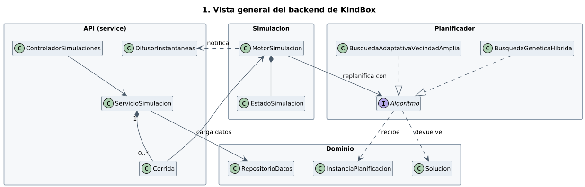
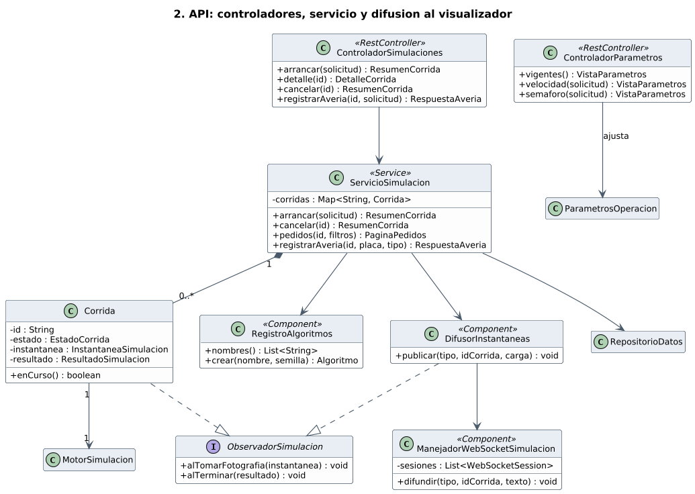
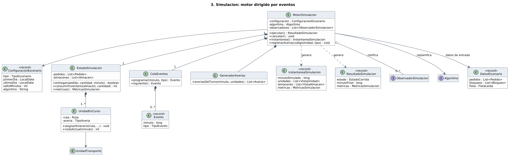
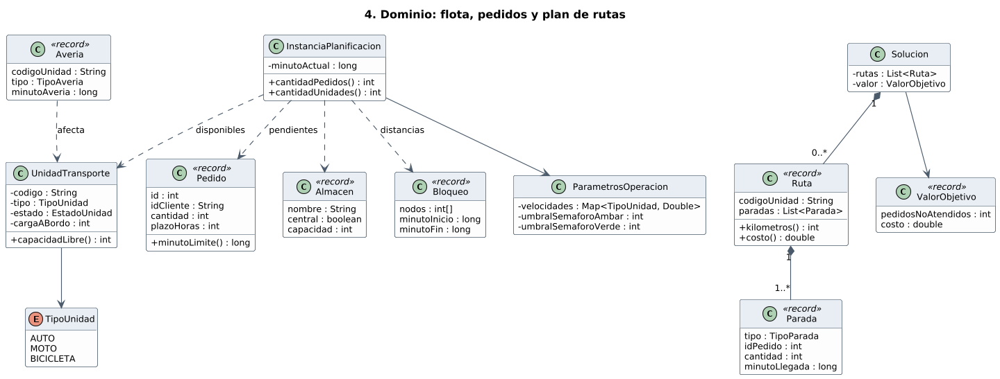
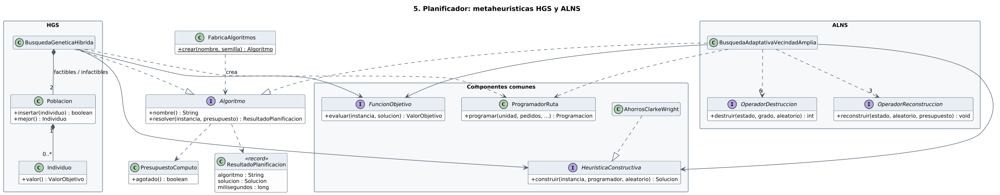

# Diagrama de clases del backend de KindBox

Version simplificada del diagrama de clases del backend desplegado (modulo `service` y la
parte de `core` que usa en ejecucion). Son cinco diagramas; cada uno muestra solo las clases
necesarias para explicar su parte y, de cada clase, solo los atributos y metodos que definen
su responsabilidad. Cada diagrama tiene su fuente PlantUML (`.puml`) y sus imagenes `.png` y `.svg`.

## 1. Vista general



El sistema tiene cuatro partes. La **API** recibe las peticiones del visualizador y crea una
**corrida** de simulacion. Cada corrida tiene un **motor de simulacion** que avanza el tiempo
y, cada cierto intervalo, pide al **planificador** (HGS o ALNS) un nuevo plan de rutas. El
planificador trabaja sobre las clases del **dominio**: recibe una `InstanciaPlanificacion`
(foto del estado actual) y devuelve una `Solucion` (rutas por unidad).

## 2. API



| Clase | Responsabilidad |
|---|---|
| `ControladorSimulaciones` | Endpoints REST para arrancar, consultar y cancelar simulaciones y registrar averias |
| `ControladorParametros` | Endpoints REST para consultar y ajustar velocidades y umbrales del semaforo |
| `ServicioSimulacion` | Logica de la API: crea y guarda las corridas, carga los datos y elige el algoritmo |
| `Corrida` | Una simulacion en curso o terminada: su estado, ultima fotografia y resultado |
| `RegistroAlgoritmos` | Crea el algoritmo (HGS o ALNS) a partir de su nombre |
| `DifusorInstantaneas` | Recibe las fotografias del motor y las envia al visualizador |
| `ManejadorWebSocketSimulacion` | Mantiene las conexiones WebSocket abiertas con el visualizador |
| `ObservadorSimulacion` | Interfaz con la que el motor avisa de cada fotografia y del final de la simulacion |

## 3. Simulacion



| Clase | Responsabilidad |
|---|---|
| `MotorSimulacion` | Ejecuta la simulacion: saca eventos de la cola, actualiza el estado y replanifica |
| `ConfiguracionEscenario` | Parametros de la corrida: tipo de escenario, fechas, salto de tiempo y algoritmo |
| `DatosEscenario` | Datos de entrada ya leidos: pedidos, bloqueos y flota |
| `EstadoSimulacion` | Estado del mundo: pedidos pendientes, inventario de almacenes y unidades |
| `UnidadEnCurso` | Una unidad de la flota con la ruta que esta recorriendo |
| `ColaEventos` / `Evento` | Eventos ordenados por minuto (llegada de pedido, averia, fin de servicio, etc.) |
| `GeneradorAverias` | Sortea averias aleatorias por turno |
| `InstantaneaSimulacion` | Fotografia que se envia al visualizador |
| `ResultadoSimulacion` | Resumen final con las metricas de la corrida |

## 4. Dominio



| Clase | Responsabilidad |
|---|---|
| `UnidadTransporte` / `TipoUnidad` | Vehiculo de la flota (auto, moto o bicicleta), su estado y su carga |
| `Pedido` | Pedido de un cliente con cantidad y plazo de entrega |
| `Almacen` | Almacen central o intermedio con su capacidad |
| `Bloqueo` | Calles cerradas durante un intervalo de tiempo |
| `Averia` | Averia de una unidad en un minuto dado |
| `ParametrosOperacion` | Parametros ajustables en ejecucion (velocidades, umbrales del semaforo) |
| `InstanciaPlanificacion` | Foto del problema en un minuto: pedidos pendientes, unidades disponibles, almacenes y distancias |
| `Solucion` / `Ruta` / `Parada` | Plan de reparto: una ruta por unidad, compuesta por paradas de entrega, abastecimiento o alimentacion |
| `ValorObjetivo` | Calidad del plan: primero, pedidos no atendidos; despues, costo |

## 5. Planificador



| Clase | Responsabilidad |
|---|---|
| `Algoritmo` | Contrato comun: recibe una instancia y un presupuesto de tiempo y devuelve un plan |
| `FabricaAlgoritmos` | Crea HGS o ALNS a partir del nombre |
| `PresupuestoComputo` | Limita el tiempo que el algoritmo puede usar en cada replanificacion |
| `ResultadoPlanificacion` | Solucion encontrada, con el tiempo empleado |
| `BusquedaGeneticaHibrida` (HGS) | Metaheuristica poblacional: evoluciona dos poblaciones de `Individuo`, una de factibles y otra de infactibles |
| `BusquedaAdaptativaVecindadAmplia` (ALNS) | Metaheuristica de trayectoria: destruye y reconstruye el plan con 6 operadores de destruccion y 3 de reconstruccion |
| `HeuristicaConstructiva` / `AhorrosClarkeWright` | Construye la solucion inicial por ahorros de Clarke y Wright |
| `FuncionObjetivo` | Evalua una solucion y calcula su `ValorObjetivo` |
| `ProgramadorRuta` | Calcula horarios, kilometros y factibilidad de una ruta |

## Que se omitio

Del sistema desplegado se dejaron fuera, para no recargar los diagramas:

- clases de soporte de la API: `ControladorSalud`, `ControladorAlmacenes`, `ManejadorDeErrores`
  y las excepciones, la configuracion de Spring, `FabricaMotor`, `AnalizadorAverias` y los DTO
  (los DTO solo aparecen como tipos de retorno);
- la interfaz `PublicadorDeEstado`: en el diagrama 2, `ServicioSimulacion` apunta
  directamente a `DifusorInstantaneas`, que es su unica implementacion;
- las clases internas de cada algoritmo: educacion, cruce y split en HGS; estado, capa
  adaptativa, criterio de aceptacion y cada operador concreto en ALNS;
- la lectura de archivos (`RepositorioDatos` y los lectores), el calculo de distancias
  (`core.grafo`) y las vistas y metricas detalladas que se envian al visualizador.

Tampoco se incluye lo que no forma parte del sistema desplegado: el modulo `experiments`,
el paquete `core.datagen`, los verificadores que solo usan las pruebas y los experimentos
(`VerificadorRestricciones`, `PruebaFactibilidadIndependiente`) y el codigo de pruebas.

## Regenerar las imagenes

Hace falta Java, Graphviz (`dot`) y el jar de PlantUML:

```bash
PLANTUML_JAR=/ruta/plantuml.jar ./render.sh
```
