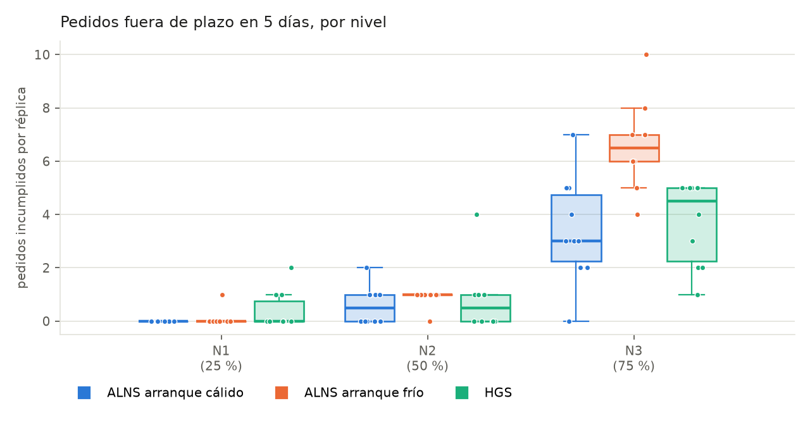
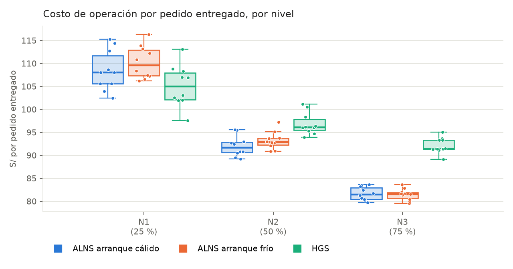
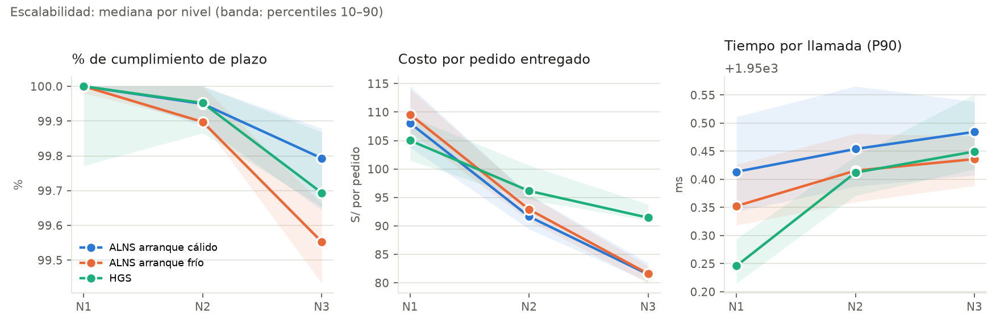
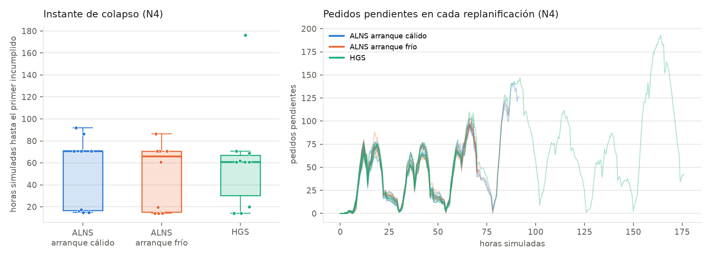
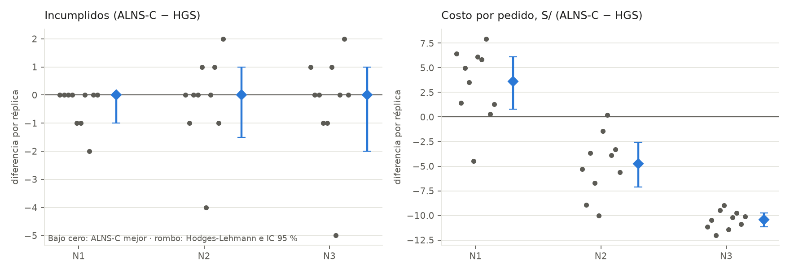

# Campaña experimental ALNS frente a HGS: resultados y análisis

Borrador para reemplazar los apartados 10 y 11 del *IEN – Informe de Diseño de Experimento*
(grupo 3C, KindBox). Los datos, el código y el análisis están en la rama
`claude/bold-albattani-rq4506`, carpeta `experiments/campana/`.

---

## 10. Resultados obtenidos

### 10.1 Alcance y condiciones de la campaña

La campaña sustituye al piloto estático del 21 de septiembre. Esta vez las corridas son
**simulaciones dinámicas completas**: los pedidos llegan en el tiempo, el planificador se
ejecuta cada 30 minutos simulados y las unidades entregan de verdad. Se cuentan los pedidos
entregados a tiempo, los entregados fuera de plazo (incumplidos) y los que quedan pendientes.

| Elemento | Valor fijado antes de ejecutar |
|---|---|
| Base de datos (S-01) | Un único juego congelado: `GenerarDatos data_campana 2026-09-01 2026-10-31 ESTABLE 384`, generado a la capacidad diaria de la flota (384 pedidos ≈ 1 536 paquetes/día). Los hashes SHA-256 de cada archivo están en `resultados/manifiesto.txt`. |
| Niveles de instancia | Submuestras **anidadas** de esa misma base: N1 = 25 %, N2 = 50 % y N3 = 75 % de los pedidos (≈ 99, 196 y 297 pedidos/día), en el escenario de 5 días. N4 es una rampa del 50 % al 100 % de la capacidad (+10 % por día), en el escenario de colapso. Todo pedido de N1 está también en N2 y en N3, así que entre niveles solo cambia el volumen. |
| Réplicas | 10 por celda. La réplica *r* es una submuestra distinta de la base (semilla 20260900 + *r*) y es también la semilla del algoritmo. **Las tres variantes resuelven exactamente la misma instancia en cada réplica**: esa es la unidad de emparejamiento de la prueba de Wilcoxon. |
| Variantes | ALNS con arranque desde el plan vigente (**ALNS-C**), ALNS con arranque constructivo (**ALNS-F**) y **HGS** (arranque constructivo, como indica el ISA). El arranque se declara como factor (S-03). |
| Función objetivo | La misma para las tres variantes: H (pedidos sin atender) dominante, luego la urgencia de lo no atendido y luego el costo S. El peso de estabilidad es el mismo para todas (S-04). |
| Perturbaciones (S-02) | **Solo bloqueos de calles**, tal como vienen en la base. Averías desactivadas y mantenimientos descartados, para que la única variación entre réplicas sea la instancia y la única variación entre variantes, el algoritmo. |
| Presupuesto | 2 000 ms por llamada (extremo inferior del rango del ISA), con 50 ms reservados para cerrar y devolver la solución. Salto de replanificación: 30 minutos. |
| Código (S-06) | Commit `45890e5`. La campaña se reanudó dos veces tras reinicios del contenedor (commits `ad378ad` y `539370b`); entre esos commits no hay ninguna diferencia en `core/`, `experiments/src/` ni en el script de la campaña. |
| Máquina (S-05) | Intel Xeon 2,10 GHz × 4 núcleos, 16 GB, OpenJDK 21.0.10. |
| Orden y concurrencia | Orden de las 120 corridas aleatorizado con semilla fija 20260924. Cada corrida en su propia JVM. **Tres corridas en paralelo** en 4 núcleos (desviación de S-07, ver riesgo R-11). |

Volumen total: 3 niveles × 3 variantes × 10 réplicas en 5D (90 corridas) + 3 variantes × 10
réplicas en colapso (30 corridas) = **120 corridas, 29 688 pedidos simulados por variante en
5D, 26 010 llamadas al planificador**. Ninguna corrida falló.

### 10.2 Validez estructural y presupuesto (H1, H4)

Tabla 1. Verificaciones por llamada al planificador.

| Verificación | ALNS-C | ALNS-F | HGS |
|---|---|---|---|
| V-1 Plan factible (capacidad, plazos, turnos, alimentación, almacenes, bloqueos) | 100 % | 100 % | 100 % |
| V-2 La función objetivo común reproduce la H y el costo que informa el algoritmo | 100 % | 100 % | 100 % |
| V-3 Llamada dentro de los 2 000 ms (medida por fuera, con reloj monotónico) | 100 % (máx. 1 965 ms) | 100 % (máx. 1 958 ms) | 100 % (máx. 1 956 ms) |
| Tiempo de pared de una simulación 5D (mediana) | 8,4 min | 8,4 min | 8,4 min |

A diferencia del piloto, donde 0 de 60 ejecuciones cumplieron V-3, ahora el 100 % de las 26 010
llamadas cierra dentro del presupuesto. La diferencia la explica la reserva de cierre de 50 ms
(apartado 11.3 del piloto).

### 10.3 Cumplimiento de plazos en la simulación de 5 días (H2, H5)

Tabla 2. Mediana [mínimo–máximo] sobre 10 réplicas.

| Nivel | Pedidos por réplica | Variante | Réplicas sin incumplidos | Incumplidos | % cumplimiento | Primer incumplido (min) | Pendientes al cierre |
|---|---|---|---|---|---|---|---|
| N1 | 494 | ALNS-C | **10/10** | 0 [0–0] | 100,00 | > 7 200 | 3 [2–5] |
| N1 | 494 | ALNS-F | 9/10 | 0 [0–1] | 100,00 | > 7 200 | 3 [2–5] |
| N1 | 494 | HGS | 7/10 | 0 [0–2] | 100,00 | > 7 200 | 3 [2–5] |
| N2 | 982 | ALNS-C | 5/10 | 0 [0–2] | 99,95 | 5 740 | 11 [6–14] |
| N2 | 982 | ALNS-F | 2/10 | 1 [0–1] | 99,90 | 4 878 | 10 [8–14] |
| N2 | 982 | HGS | 5/10 | 0 [0–4] | 99,95 | 6 951 | 11 [6–15] |
| N3 | 1 486 | ALNS-C | 1/10 | 3 [0–7] | 99,79 | 897 | 29 [22–33] |
| N3 | 1 486 | ALNS-F | 0/10 | 6 [4–10] | 99,55 | 840 | 32 [24–34] |
| N3 | 1 486 | HGS | 0/10 | 4 [1–5] | 99,69 | 904 | 34 [29–37] |

"% cumplimiento" = entregados a tiempo / (entregados + incumplidos). Los pendientes al cierre
son pedidos que siguen dentro de su plazo en el minuto 7 200 y por tanto no son incumplidos.

En total, sumando las 30 corridas 5D de cada variante:

| | ALNS-C | ALNS-F | HGS |
|---|---|---|---|
| Corridas sin incumplidos | **16/30** | 11/30 | 12/30 |
| Pedidos incumplidos (de 29 688) | **40** | 75 | 49 |



*Figura 1. Pedidos entregados fuera de plazo por réplica. Cada punto es una réplica.*

### 10.4 Costo de operación (H7)

Tabla 3. Costo por pedido entregado, mediana [mín–máx], en soles.

| Nivel | ALNS-C | ALNS-F | HGS | ALNS-C frente a HGS |
|---|---|---|---|---|
| N1 | 108,06 [102,51–115,27] | 109,59 [106,24–116,30] | **105,01** [97,62–113,13] | +2,9 % |
| N2 | **91,64** [89,27–95,56] | 92,90 [90,88–97,28] | 96,15 [93,92–101,17] | −4,7 % |
| N3 | **81,50** [79,70–83,63] | 81,60 [79,59–83,67] | 91,45 [89,17–95,04] | −10,9 % |



*Figura 2. Costo de operación por pedido entregado.*



*Figura 3. Escalabilidad por nivel (mediana; banda: percentiles 10–90). En el panel de tiempo
las tres líneas coinciden: todas las variantes agotan el presupuesto menos la reserva
(≈ 1 950 ms) y ninguna llamada lo supera.*

### 10.5 Escenario de colapso (H6)

Tabla 4. Instante del primer pedido fuera de plazo en la rampa N4 (10 réplicas; ninguna
llegó a los 30 días sin colapsar).

| Variante | Mediana | Mínimo | Máximo |
|---|---|---|---|
| ALNS-C | **4 250 min (70,8 h; día 3, 22:50)** | 897 min (15,0 h) | 5 506 min (91,8 h) |
| ALNS-F | 3 952 min (65,9 h) | 840 min (14,0 h) | 5 187 min (86,5 h) |
| HGS | 3 655 min (60,9 h) | 840 min (14,0 h) | 10 570 min (176,2 h) |



*Figura 4. Izquierda: horas simuladas hasta el primer incumplido. Derecha: pedidos pendientes
en cada replanificación; cada línea es una réplica y termina en su colapso.*

### 10.6 Contrastes estadísticos

**Procedimiento, fijado antes de ver los resultados:**
- **Prueba:** Wilcoxon de rangos con signo, exacta y bilateral, emparejada por réplica. Las diferencias nulas se descartan (procedimiento de Wilcoxon). Si todas las diferencias son nulas, no hay prueba.
- **Tamaño del efecto:** estimador de Hodges-Lehmann (HL) con su intervalo de confianza exacto del 95 %, y correlación biserial de rangos.
- **Multiplicidad:** corrección de Holm dentro de cada familia, con α = 0,05. La familia principal es ALNS-C frente a HGS (13 contrastes); la del arranque, ALNS-C frente a ALNS-F (13 contrastes).
- **Censura:** a una corrida 5D sin incumplidos se le asigna el minuto 7 200, lo que solo puede acortar la diferencia.
- **Verificación:** la implementación da exactamente los mismos valores p que `scipy.stats.wilcoxon`.

Tabla 5. Familia principal: ALNS-C − HGS por réplica. Un HL negativo favorece a ALNS-C en
incumplidos, pendientes y costo; uno positivo lo favorece en minuto de incumplido y de colapso.

| Nivel | Métrica | ALNS-C mejor / HGS mejor / empates | HL [IC 95 %] | p | p Holm | Lectura |
|---|---|---|---|---|---|---|
| N1 | Incumplidos | 3 / 0 / 7 | 0 [−1; 0] | 0,250 | 1,000 | sin diferencia |
| N1 | Costo por pedido (S/) | 1 / 9 / 0 | +3,63 [+0,81; +6,11] | 0,020 | 0,195 | sin diferencia tras Holm |
| N2 | Incumplidos | 3 / 3 / 4 | 0 [−2; 1] | 1,000 | 1,000 | sin diferencia |
| N2 | Primer incumplido (min) | 4 / 4 / 2 | +244 [−2 901; 3 201] | 0,813 | 1,000 | sin diferencia |
| N2 | Costo por pedido (S/) | **9 / 1 / 0** | **−4,74 [−7,11; −2,56]** | 0,004 | **0,043** | **ALNS-C más barato** |
| N3 | Incumplidos | 3 / 3 / 4 | 0 [−2; 1] | 1,000 | 1,000 | sin diferencia |
| N3 | Pendientes al cierre | **10 / 0 / 0** | **−6 [−8; −4]** | 0,002 | **0,025** | **ALNS-C deja menos** |
| N3 | Costo por pedido (S/) | **10 / 0 / 0** | **−10,45 [−11,15; −9,75]** | 0,002 | **0,025** | **ALNS-C más barato** |
| N4 | Minuto de colapso | 6 / 3 / 1 | +114 [−3 937; 1 799] | 0,715 | 1,000 | sin diferencia |

Tabla 6. Familia del arranque: ALNS-C − ALNS-F (solo los contrastes con p < 0,1 antes de
corregir; la tabla completa está en `resultados/tablas.md`).

| Nivel | Métrica | Cálido mejor / frío mejor / empates | HL [IC 95 %] | p | p Holm | Lectura |
|---|---|---|---|---|---|---|
| N3 | Incumplidos | **10 / 0 / 0** | **−3 [−4; −2]** | 0,002 | **0,025** | **el arranque cálido reduce los incumplidos** |
| N2 | Costo por pedido (S/) | 9 / 1 / 0 | −1,43 [−2,20; −0,08] | 0,027 | 0,328 | sin diferencia tras Holm |
| N3 | Primer incumplido (min) | 5 / 1 / 4 | +279 [0; 3 180] | 0,063 | 0,688 | sin diferencia |



*Figura 5. Diferencia ALNS-C − HGS en cada réplica (puntos) y estimador de Hodges-Lehmann con
su IC del 95 % (rombo).*

### 10.7 Estado de las hipótesis

| Hipótesis | Criterio del diseño | Resultado | Estado |
|---|---|---|---|
| H1 Corrección | 100 % de ejecuciones pasan V-1 a V-4 | V-1, V-2 y V-3: 100 % en las tres variantes. V-4 no se midió (ver R-12). | **H₀ rechazada** para V-1 a V-3 en ambos algoritmos |
| H2 Cero pérdidas | H = 0 y 0 pedidos fuera de plazo en el 100 % de las ejecuciones N1–N3 | ALNS-C 16/30, ALNS-F 11/30 y HGS 12/30 corridas sin incumplidos | **H₀ se mantiene para los tres**; solo ALNS-C lo cumple en N1 (10/10) |
| H3 Perturbaciones | 100 % de ejecuciones forzadas por un evento cierran con H = 0 | No aislado: las replanificaciones por bloqueo están dentro de las corridas 5D, sin registro separado | No evaluada por separado |
| H4 Presupuesto | ≥ 95 % de llamadas dentro del presupuesto; 5D en 30–60 min | 100 % de las llamadas dentro; la 5D completa en 8,4 min en modo libre | **H₀ rechazada** en el presupuesto por llamada. El rango de 30–60 min es del modo acompasado y no aplica al modo libre. |
| H5 Degradación acotada | tiempo N3 ≤ 4× N1; H = 0 en el 100 % de N1–N3; costo sin saltos | Tiempo constante (presupuesto fijo); H = 0 no se sostiene; el costo por pedido **baja** de forma monótona | **H₀ se mantiene** por la segunda condición |
| H6 Régimen extremo | diferencia de medianas del instante de colapso ≥ 4 h | ALNS-C 70,8 h frente a HGS 60,9 h: 9,9 h de diferencia. Wilcoxon pareado p = 0,71, HL +1,9 h [−65,6 h; +30,0 h] | **Criterio de umbral cumplido a favor de ALNS, pero no respaldado estadísticamente** |
| H7 Costo | diferencia ≥ 5 % sostenida en 3 de 4 niveles | +2,9 % (N1), −4,7 % (N2), −10,9 % (N3); significativa tras Holm en N2 y N3 | **H₀ se mantiene (empate operativo)** según el criterio de umbral; la ventaja de ALNS crece con el volumen |

---

## 11. Análisis y discusión

### 11.1 Aplicación de los criterios de decisión (apartado 9)

**Paso 1, filtro de corrección.** Ambos algoritmos lo superan: ningún plan de las 26 010
llamadas viola una restricción dura y el objetivo común reproduce siempre lo que informa cada
algoritmo.

**Paso 2, cero pedidos perdidos.** **Ninguno de los dos lo supera** en N2 y N3. Según la regla
del propio diseño, *"si ambos algoritmos fallan este filtro, no se declara ganador: se reporta
el hallazgo, se corrige la implementación y se repite la campaña"*. Por tanto **la campaña no
declara un ganador operativo definitivo**. Lo que sí aporta es evidencia de hacia dónde se
inclina la decisión y de qué hay que corregir antes de repetirla.

**Pasos 3 y 4 (a título indicativo).**
- **Presupuesto:** los dos algoritmos lo cumplen por igual.
- **Incumplimientos:** no hay diferencia significativa entre ALNS-C y HGS en ningún nivel. ALNS-C acumula 40 incumplidos frente a 49 de HGS y es la única variante con 10/10 réplicas limpias en N1, pero con 10 réplicas esa diferencia no se distingue del azar.
- **Costo y pendientes:** aquí sí hay evidencia fuerte y creciente con el volumen. ALNS-C es un 4,7 % más barato por pedido en N2 y un 10,9 % en N3, gana en las 10 réplicas de N3 y deja 6 pedidos pendientes menos al cierre (IC 95 % [4; 8]). En N1, donde sobra flota, HGS es algo más barato (+2,9 %), sin significancia tras la corrección.
- **Colapso:** ALNS-C sostiene H = 0 unas 10 horas más en mediana (se cumple el umbral de 4 h de H6), pero la dispersión entre réplicas es enorme (de 15 a 176 h) y el contraste pareado no es significativo.

**Lectura conjunta.** Si hubiera que elegir hoy, la evidencia favorece a **ALNS con arranque
desde el plan vigente**: nunca es significativamente peor que HGS en cumplimiento, y es
significativamente mejor en costo y en pedidos pendientes justo en los niveles de mayor carga.
Esa elección queda condicionada a superar el paso 2 tras la corrección del apartado 11.3.

### 11.2 El arranque cálido es parte de la ventaja (riesgo R-03)

El factor de arranque, declarado en S-03, muestra un efecto propio: en N3 el arranque desde el
plan vigente reduce los incumplidos en 3 por réplica (IC 95 % [2; 4]) en las 10 de 10 réplicas.
Frente a HGS, en cambio, ALNS con arranque constructivo (ALNS-F) no es mejor en incumplidos
(75 contra 49 en total). La ventaja en cumplimiento de ALNS-C se debe por tanto, en buena
parte, a la capacidad de partir del plan vigente, que el ISA solo concede a ALNS.

En costo la situación es la contraria: ALNS-F y ALNS-C cuestan prácticamente lo mismo, y los
dos son más baratos que HGS en N2 y N3. **La ventaja en costo es del mecanismo de búsqueda; la
ventaja en cumplimiento es del arranque.** Conviene declararlo así en la decisión, tal como
pide R-03.

### 11.3 Causas de los incumplidos: diagnóstico por pedido

Para no quedarse en los conteos, la réplica 1 de N3 se repitió con el diagnóstico por pedido
(`-DdiagnosticoPedidos=true`). El diagnóstico sigue a cada pedido incumplido en todas las
replanificaciones que lo vieron y clasifica la causa:

- **PLAN_ROTO**: estuvo asignado a tiempo y una replanificación posterior lo soltó.
- **COMPETENCIA**: solo unidades ya ocupadas podían atenderlo.
- **IMPOSIBLE_FISICO**: ni un auto libre en el almacén más cercano llegaba a tiempo.

| Variante | Incumplidos | Pedidos y causa |
|---|---|---|
| ALNS-C | 1 | 1109 (COMPETENCIA) |
| ALNS-F | 4 | 94, 133 y 1286 (PLAN_ROTO); 1109 (COMPETENCIA) |
| HGS | 2 | 73 y 1321 (PLAN_ROTO) |

Ningún incumplido es IMPOSIBLE_FISICO: todos eran alcanzables. Se leen tres cosas:

1. **Las variantes sin arranque desde el plan vigente pierden pedidos que ya tenían.** 5 de
   los 6 incumplidos de ALNS-F y HGS son PLAN_ROTO: el pedido estuvo asignado dentro de plazo
   y una replanificación que partió de cero lo soltó. Es el mismo mecanismo que el apartado
   11.2 mide a nivel agregado, visto ahora pedido a pedido.
2. **El límite efectivo por cierre de turno.** Una entrega exige una hora de
   acondicionamiento que debe terminar dentro del turno. Un pedido que vence en la última hora
   de un turno tiene, en la práctica, su límite en el cierre del turno menos 60 minutos. Los
   planificadores comparan contra el límite nominal y lo difieren creyendo que les sobra
   tiempo:
   - el **pedido 1109** vence a las 22:50, pero su límite real eran las 22:00;
   - el **pedido 133** vence a las 14:57, pero su límite real eran las 14:00;
   - el **pedido 1321** vence a las 14:27, 33 minutos antes del cierre de las 15:00, así que su límite real eran las 14:00.

   Si los pedidos vencieran al azar a lo largo del día, en esa franja caería 1 de cada 8
   incumplidos. Aquí caen 4 de los 7. El pedido 1109 es además el colapso mediano de ALNS-C
   en N4 (minuto 4 250).
3. **Una diferencia genuina a favor de HGS.** El pedido 1109 (33 paquetes, más que la
   capacidad de un auto) exige dos entregas parciales. ALNS no llegó a colocarlo en ninguna
   de las nueve replanificaciones que lo vieron; HGS sí lo entregó, a las 21:55, 5 minutos
   antes de su límite real.

**Colapso (N4).** La réplica 1 de N4 se repitió también con el diagnóstico. Las tres
variantes colapsaron en el mismo pedido, el 1109, en el minuto 4 250 (día 3, 22:50, con la
rampa al 70 %). Es el mismo pedido grande que vence en la última hora del turno: ALNS-C y
ALNS-F nunca lo asignaron (COMPETENCIA) y HGS lo tuvo asignado y lo soltó (PLAN_ROTO). El
colapso de N4 no lo decide la saturación general de la flota, sino un pedido concreto con un
límite efectivo más temprano que el nominal.

**Reproducibilidad del colapso.** En la campaña, esa misma réplica colapsó en el minuto 897
con ALNS-C, en el 4 250 con ALNS-F y en el 10 570 con HGS; repetida, las tres colapsan en el
4 250. Con presupuesto de reloj, cada ejecución completa un número distinto de iteraciones y
toma decisiones distintas, así que la misma instancia y la misma semilla no garantizan el mismo
plan (como ya advertía el apartado 10.5 del piloto). Esa variabilidad de la búsqueda se suma a
la variabilidad entre instancias y explica buena parte de la dispersión de la tabla 4 (de 14 a
176 horas). Por eso el instante de colapso necesita más réplicas, o repeticiones por réplica,
para resolver diferencias entre algoritmos.

**Corrección propuesta antes de repetir la campaña** (regla del paso 2):
- Usar un límite efectivo, min(límite, cierre del turno − 60 min), en el nivel de urgencia de la función objetivo común y en el compromiso de ALNS.
- Revisar cómo inserta ALNS los pedidos que requieren entregas parciales.

Ambos cambios afectan al objetivo común o al algoritmo, así que se aplican antes de una nueva
campaña, nunca a mitad de esta.

### 11.4 Límites de la campaña

- **Un solo presupuesto** (2 s, el mínimo del ISA). En un ensayo previo, con otro juego de datos (ESTABLE, 200 pedidos/día) y con averías activas, ALNS-C pasó de 4/5 réplicas sin incumplidos con 2 s a 5/5 con 5 s. Ese ensayo no es comparable con esta campaña, pero indica que el presupuesto importa. El factor presupuesto del diseño (2, 5, 10 y 18 s) queda pendiente.
- **Sin averías ni mantenimientos**, por decisión expresa: las conclusiones valen para un entorno con bloqueos. H3 queda sin evaluar por separado.
- **Diez réplicas por celda.** Con n = 10 el valor p exacto más pequeño posible es 0,002. Las diferencias en incumplidos, de 0 a 3 pedidos entre 1 000 y 1 500, necesitarían más réplicas para resolverse.
- **Escenario día a día no ejecutado**: los niveles se evaluaron en 5D y en colapso.

## 12. Riesgos a la validez (adiciones)

| ID | Riesgo | Efecto | Tratamiento |
|---|---|---|---|
| R-11 | Tres corridas en paralelo en 4 núcleos, en lugar de ejecución secuencial (S-07). | La contención de CPU podría restar iteraciones a una variante. | El orden es aleatorio y compartido por las tres variantes; ninguna llamada superó el presupuesto (máximo 1 965 ms); el tiempo de pared de la 5D es idéntico entre variantes (8,43 min). |
| R-12 | V-4 (monotonía respecto de la solución inicial) no se instrumentó. | Una búsqueda que devolviera una solución peor que la constructiva no se detectaría. | V-2 garantiza que el valor informado es el real. Queda como verificación pendiente. |
| R-13 | La cota de S-11 se expresa en pedidos, pero el código la define en paquetes (1 536 paquetes/día ≈ 384 pedidos/día). | Un lector podría esperar un volumen cuatro veces mayor en N4. | Corregir el texto de S-11 y H6; la campaña usa la cota en paquetes. |
| R-15 | Búsqueda limitada por reloj, no reproducible exactamente. | La misma réplica repetida dio colapsos de 897, 4 250 y 10 570 min según la ejecución. | Reportar mediana y rango, emparejar por instancia y, para H6, aumentar las réplicas o repetir cada una varias veces. |
| R-14 | La campaña se interrumpió dos veces por reinicios del contenedor. | Podría mezclar configuraciones. | Cada corrida es independiente y reanudable. No hubo ningún cambio de código ni de datos entre reanudaciones (verificado con `git diff`), y los hashes del manifiesto se mantienen. |

## Reproducción

```bash
./mvnw -q -DskipTests install
experiments/campana/correr_campana.sh 3 2000      # 120 corridas, reanudable
python3 experiments/campana/analizar.py            # tablas.md, pruebas.csv, figuras/
```

Archivos en `experiments/campana/resultados/`:
- `campana.csv`: una fila por corrida.
- `resultados_formato_plantilla.csv`: las mismas corridas con las columnas de la plantilla del otro grupo.
- `pruebas.csv`: todos los contrastes.
- `series/`: pedidos pendientes en cada replanificación.
- `manifiesto.txt`: commit, máquina y hashes de los datos.
