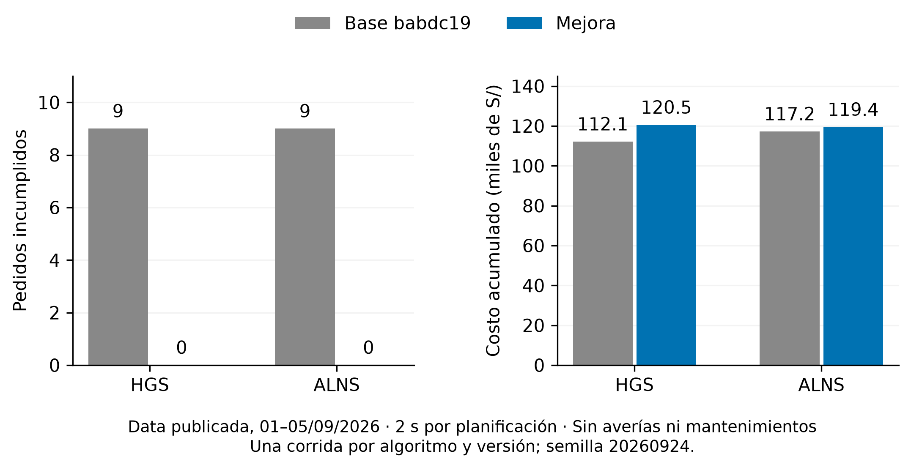

# Resultados de la mejora de cumplimiento

Se adaptó la rama `claude/bold-albattani-rq4506` (`530aa17`) sobre main `babdc19`.
Se incorporó su prioridad de urgencia y reserva de cierre, corrigiendo problemas del
comparador, de la cota de HGS y de la protección de pedidos urgentes en ALNS.
Se añadió recuperación del plan vigente a HGS, memoria de la pausa por turno y prioridad
según la última hora de servicio posible antes del cierre del turno. No se relajaron
los plazos contractuales ni se eliminaron pedidos para mejorar las métricas.

## Validación operativa de cinco días

Datos publicados `c.1inf54.26-2.data_publicada-20260922T020815Z-1-001`, del 1 al 5 de
septiembre de 2026: 795 pedidos, 98 bloqueos y 37 unidades. Semilla 20260924, presupuesto
nominal de 2000 ms por planificación y reloj libre. Sin averías ni mantenimientos.
La base usaba arranque desde cero; la mejora usa el plan vigente. Se compara el conjunto
de cambios, no el efecto aislado de cada componente.

| Métrica | HGS base | HGS mejorado | ALNS base | ALNS mejorado |
|---|---:|---:|---:|---:|
| Minutos simulados | 7200 | 7200 | 7200 | 7200 |
| Pedidos entregados | 762 | 775 | 763 | 775 |
| Pendientes dentro del plazo al cierre | 24 | 20 | 23 | 20 |
| Incumplidos | 9 | **0** | 9 | **0** |
| Paquetes entregados | 4280 | 4359 | 4265 | 4363 |
| Kilómetros | 16968 | 18014 | 18130 | 18542 |
| Costo del modelo | 112113 | 120498 | 117191 | 119437 |
| Tiempo real, segundos | 837,030 | 816,082 | 836,913 | 815,951 |

Ambas corridas terminaron en `CULMINADA`. Los 20 pendientes no habían vencido al cierre;
no se afirma haber entregado los 795 dentro del horizonte. El costo aumentó un 7,48 % en
HGS y un 1,92 % en ALNS: se priorizó cumplimiento sobre costo.

Se auditaron los 420 planes de cada algoritmo con `VerificadorRestricciones` y recálculo
del objetivo: 840 planes válidos, sin sobregiros del presupuesto nominal. Máximos de
planificación: 1951 ms para HGS y 1950 ms para ALNS. La reserva de 50 ms reduce el tiempo
de búsqueda; la diferencia de duración total no demuestra mayor velocidad de búsqueda.

Fuentes: [base.json](base.json), [operativa-HGS.csv](operativa-HGS.csv),
[operativa-ALNS.csv](operativa-ALNS.csv), [entorno.json](entorno.json).

## Sensibilidad y ablación

Se ejecutaron 24 corridas adicionales: rama original y versión final, HGS y ALNS,
primeros días 1 y 6 de septiembre, semillas 20260924, 20260925 y 20260926.
Cada corrida cubrió un día con 200 ms nominales y arranque vigente, sin incidencias.
Este presupuesto es deliberadamente corto y está fuera del rango operativo de 2–18 s.

| Versión | Algoritmo | Corridas sin incumplidos / total | Incumplidos acumulados |
|---|---|---:|---:|
| Rama original | HGS | 3/6 | 3 |
| Mejora | HGS | 5/6 | 1 |
| Rama original | ALNS | 4/6 | 2 |
| Mejora | ALNS | 6/6 | 0 |

La mejora HGS todavía incumplió un pedido el 6 de septiembre con semilla 20260926 y
200 ms. Por tanto, estos resultados no garantizan ausencia de colapso para cualquier
fecha, semilla o presupuesto. Las dos ablaciones sin plan vigente, del 1 de septiembre
con semilla 20260924 y 200 ms, terminaron sin incumplidos; este contraste corto no permite
atribuir por sí solo la mejora al arranque vigente.

Datos completos: [sensibilidad.csv](sensibilidad.csv), [ablacion.csv](ablacion.csv).
Los diagnósticos anteriores al código final quedan separados en [exploracion.json](exploracion.json).

## Verificación y límites

- `./mvnw -q install`: **219 pruebas, cero fallos, errores u omisiones**, incluyendo
  recuperación de planes, identidad de compromisos urgentes, transitividad del objetivo,
  pausa por turno, plazo efectivo y contratos del servicio.
- La preparación de datos conserva las ventas byte por byte y la geometría y ventanas
  de bloqueos. Los hashes y condiciones están en `entorno.json`.
- Una corrida completa por algoritmo no constituye evidencia estadística general.
  Los límites por reloj pueden cambiar el resultado incluso con la misma semilla.
- No se midió el rendimiento con averías o mantenimientos en esta comparación.
- Un pedido vencido viola la política de entrega. H.3 define colapso por ausencia de una
  asignación factible; el motor detecta el vencimiento, no prueba anticipadamente esa
  inexistencia. No se cambió el detector para ocultar incumplimientos.
- El verificador existente evalúa el plazo a la llegada y el servicio dentro del turno.
  Evitar pausas repetidas no certifica todas las jornadas: el programador existente puede
  omitir una pausa si no encuentra dónde insertarla. Esa limitación sigue pendiente.

El [plan y las instrucciones de reproducción](PLAN.md) detallan comandos y controles.
Tras instalar esta versión, se debe reiniciar el servicio para que cargue el nuevo core.
